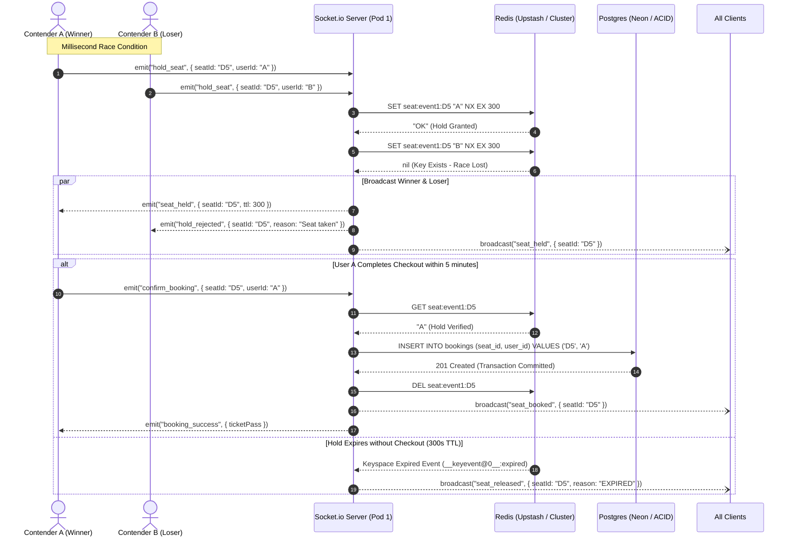
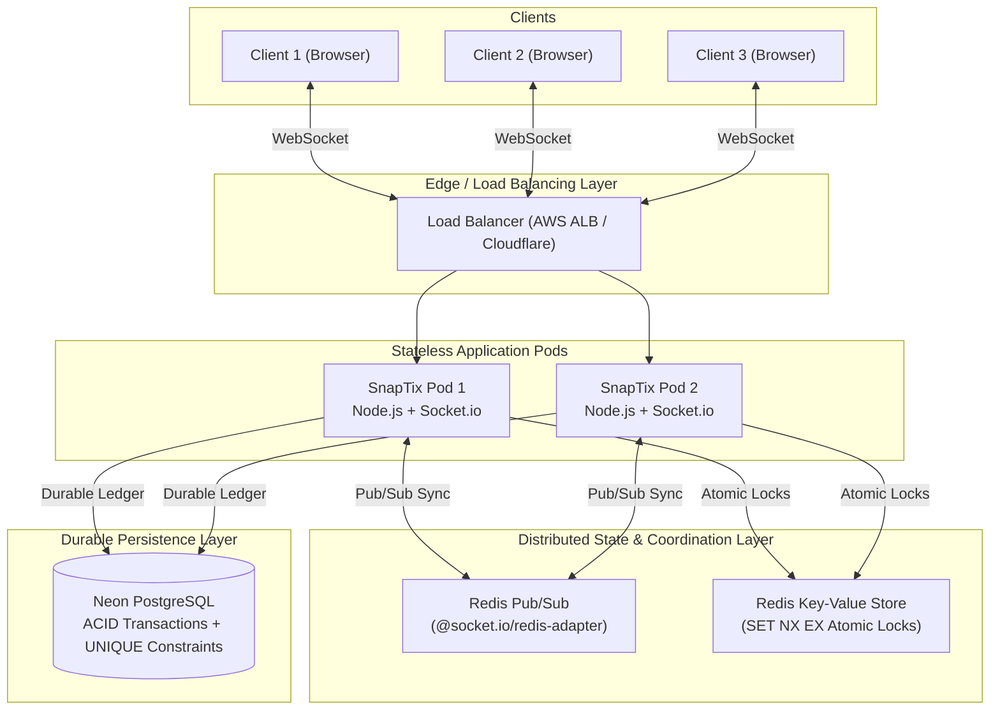
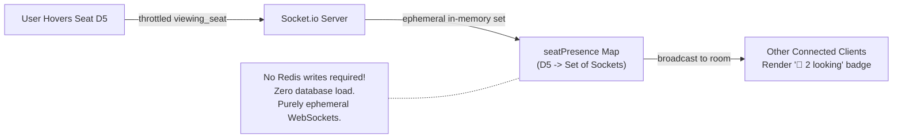

# SnapTix — System Architecture & Data Flow

This document details the multi-instance deployment architecture, real-time event pipeline, and lifecycle states of the SnapTix platform.

---

## 1. End-to-End Seat Lifecycle Sequence

---

## 2. Multi-Instance Cluster Scalability Architecture

---

## 3. Ephemeral Live Presence Architecture

